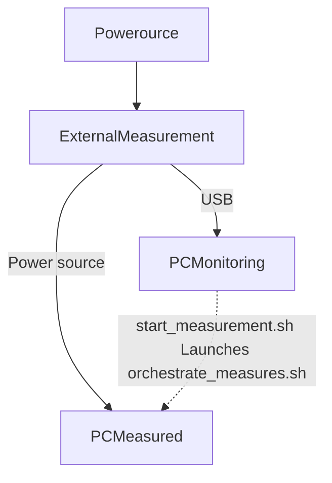

# conponent-monitoring

Tools for analysing energy consumption of a pc with detailed informations.
What are the components i want to analyse with the best accuracy:
- CPU
- RAM
- I/O (discs)
- NIC
This is combined with an external energy consumption module (Yoctopuce) with a 100Hz frequency.



The external measurments could be done on the same pc as the PC measured but for my purpose, it is done on the monitoring PC.
## Installation

The installation is relatively simple, you need to clone the repo on both machines, change the ip of the measured pc in the `start_measurements.sh` script (create an ssh key for the monitoring pc to connect to the measured pc). Then create a python virtual environment and install all dependancies. This can be done with these commands :

```bash
git clone https://github.com/bilberats/component-monitoring.git
cd component-monitoring
python -m venv .venv
source .venv/bin/activate
pip install -r requirements.txt
```  

## Start the main script

The main scipt collects all measurements from the measured pc and the external measurements (Yoctopuce).  
Data (CSV files) is stored on both pc and have to be retreived manually for the moment.

The scipt starts with this command:  
```bash
source .venv/bin/activate
bash start_measurements.sh
```

## How ?

What i did is make a script to measure each of those components, the scripts are:  
- `measure_cpu.sh` : uses turbostat

- `measure_io.sh` : uses `/sys/block/sda/stat` which are the cumulative stats since boot of the I/O (`read_kB` and `write_kB`). With a delta, we can have the stats from the interval. 

- `measure_nic.sh` : similarily, this uses the stats from `/sys/class/net/eno1/statistics/rx_bytes` and `/sys/class/net/eno1/statistics/tx_bytes` which are the received bits and the transmited bits. With a delta, we can have the stats from the interval.

- `measure_ram.sh` : Measures the LLC operations (`LLC-loads` and `LLC-stores`) that we can then use to estimate the ram consumption.

All of those scripts save a CSV file with relevant information with the timestamp.

For time synchronisation purposes,
installed chrony on both marchines and enable it:  
`apt install chrony`
`sudo systemctl enable --now chrony`

Check for synchronisation  
`chronyc tracking`

### What are the best relevant measures from turbostat

From turbostat, i can have acces to all those measures:  
`usec,Time_Of_Day_Seconds,Core,CPU,APIC,X2APIC,Avg_MHz,Busy%,Bzy_MHz,TSC_MHz,IPC,IRQ,NMI,SMI,LLCkRPS,LLC%hit,POLL-,POLL,C1-,C1,C1+,C1E-,C1E,C1E+,C3-,C3,C3+,C6-,C6,C6+,POLL%,C1%,C1E%,C3%,C6%,CPU%c1,CPU%c3,CPU%c6,CPU%c7,CoreTmp,CoreThr,PkgTmp,GFX%rc6,GFXMHz,GFXAMHz,Pkg%pc2,Pkg%pc3,Pkg%pc6,Pkg%pc7,PkgWatt,CorWatt,GFXWatt`  

The measures I kept are :   
- `Time_Of_Day_Seconds`: Wall-clock timestamp of the sample (seconds since midnight).
- `Avg_MHz`: Average CPU frequency including idle time.
- `Busy%`: Percentage of time the CPU cores were active (not idle).
- `Bzy_MHz`: Average CPU frequency while cores were busy.
- `C6%`: Percentage of time cores spent in deep sleep (C6).
- `CoreTmp`: Average CPU core temperature (°C).
- `PkgTmp`: Temperature of the full CPU package (°C).
- `PkgWatt`: Total CPU package power consumption (watts).
- `CorWatt`: Power consumed by CPU cores only (watts). 
- `LLCkRPS`: Total last-level cache (LLC) accesses per second, in thousands (loads + stores).
- `LLC%hit`: Percentage of LLC accesses that hit the cache instead of going to DRAM.

They seem to be the most relevant for accurate CPU consumption estimation 

### What i discovered

The ram measurement script i made don't actually reads the ram power, it reads the PP0 (core subsystem) consumption in joule, so that is : 
- uncore
- integrated GPU (in this case ~nothing)
- DRAM  

So my best option to estimate ram consumption is by doing so :  
With turbostat i can get the CPU package consumption as well as the CPU core consumption, with these we can actually compute the uncore consumption by doing so : $`Uncore + Memory ≈ PkgWatt − CorWatt`$

So from doing so we get: 
Here’s a concise one-line description for each :

- LLC (Last Level Cache): The largest CPU cache shared across cores, storing frequently accessed data to reduce memory latency.
- Ring: The on-chip interconnect linking CPU cores, caches, and memory controllers for data communication.
- Memory Controller: Hardware that manages read/write access between the CPU and RAM.
- DRAM Activity: The level of reads, writes, and refresh operations happening in the system’s main memory (RAM).

The problem is that i cant have access to all of those measures on my system.
I tried using perf :  

`perf stat -a -e cas_count_read/,unc_imc_0/cas_count_write/ sleep 1`  

`perf stat -a -e unc_imc_0/cas_count_read/,unc_imc_0/cas_count_write/ sleep 1`  

`perf stat -a -e UNC_RING:ANY_EVENT sleep 1` 

`perf stat -a -e LLC-loads,LLC-load-misses,LLC-stores,LLC-store-misses sleep 1`

But the only metrics i am able to get are `LLC-loads` and `LLC-stores`. In addition, those metrics are available in turbostat :
- `LLCkRPS`: Total last-level cache (LLC) accesses per second, in thousands (loads + stores).
- `LLC%hit`: Percentage of LLC accesses that hit the cache instead of going to DRAM.

Whith these metric (they can be redondant) I can approximate the RAM consumption. 

ECOFLOC uses this formula for RAM consumption estimation:
$$E_{ram_i} = N_{R_i} × ER +N_{W_i} × E_W$$


- $`E_{ram_i}`$ – Total energy consumed by the RAM during interval \(i\). This is the quantity ECOFLOC estimates for each measurement period.

- $`N_{R_i}`$ – Number of read operations performed by the application on the RAM during interval \(i\).

- $`N_{W_i}`$ – Number of write operations performed by the application on the RAM during interval \(i\).

- $`E_R`$ – Energy consumed by a single read operation. This value comes from performance measurements or RAM benchmarking studies.

- $`E_W`$ – Energy consumed by a single write operation, also obtained from performance profiling or benchmarks.

What I have to do is recover the energy consumed by those operations.